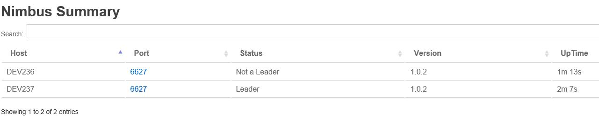

# 文档

## 0 简介

### 0.1 项目目标

**实时** **工业** **大数据** **分析**

### 0.2 系统简介

系统版本:

    OS:        CentOS 7 1511 版
    Python:    2.7.5 (CentOS 7 自带)
    Java:      1.8.0_65 (CentOS 7 自带)
    Zookeeper: 3.4.9
    Storm:     1.0.2
    Scala:     2.11.8
    Kafka:     0.9.0.1
    Maven:     3.3.9

IP 及 端口 分配:

    Zookeeper: 192.168.1.1 192.168.1.2 192.168.1.3 开放端口: 2181 2888 3888
    Storm: Nimbus: 192.168.1.4 192.168.1.5
           Supervisor: 192.168.1.6 192.168.1.7 192.168.1.8 192.168.1.9 开放端口: 6700 6701 6702 6703
    Kafka: Broker: 192.168.1.10 192.168.1.11 192.168.1.12

## 1 Zookeeper

### 1.1 简介

Apache Zookeeper 是 Hadoop 的一个子项目, 是一个致力于开发和管理开源服务器, 并且能实现高可靠性的分布式协调框架. 它包含一个简单的原语集, 分布式应用程序可以基于它实现同步服务, 配置维护和命名服务等.

Zookeeper 保证 2n + 1 台机器的集群最大允许 n 台机器挂掉而事务不中断.

#### 1.1.1 角色

Zookeeper 中的角色主要有以下三类, 如下表所示:


系统模型如图所示:


#### 1.1.2 ZooKeeper 的工作原理

详见: http://ifeve.com/zookeeperover/

### 1.2 搭建

#### 1.2.1 单机模式

此模式主要用于**开发人员本地环境下测试代码**

##### 1.2.1.1 解压 Zookeeper 并进入其根目录

```bash
tar -xzf zookeeper-3.4.9.tar.gz -C /usr/local/
cd /usr/local/zookeeper-3.4.9
```

##### 1.2.1.2 创建配置文件 conf/zoo.cfg

```bash
cp conf/zoo_sample.cfg conf/zoo.cfg
```

##### 1.2.1.3 修改内容如下:

```bash
tickTime=2000
initLimit=10
syncLimit=5
dataDir=/var/lib/zookeeper/data
dataLogDir=/var/lib/zookeeper/log
clientPort=2181
```

* tickTime: 是 zookeeper 的最小时间单元的长度(以毫秒为单位), 它被用来设置心跳检测和会话最小超时时间(tickTime 的两倍)
* initLimit: 初始化连接时能容忍的最长 tickTime 个数
* syncLimit: follower 用于同步的最长 tickTime 个数
* dataDir: 服务器存储 **数据快照** 的目录
* dataLogDir: 服务器存储 **事务日志** 的目录
* clientPort: 用于 client 连接的 server 的端口.

其中需要注意的是`dataDir`和`dataLogDir`, 分别是 zookeeper 运行时的数据目录和日志目录, 要保证 **这两个目录已创建** 且 **运行 zookeeper 的用户拥有这两个目录的所有权**

##### 1.2.1.4 测试

启动/关闭 Zookeeper:

```bash
bin/zkServer.sh start
bin/zkServer.sh stop
```

使用 java 客户端连接 ZooKeeper

```bash
./bin/zkCli.sh -server 127.0.0.1:2181
```

然后就可以使用各种命令了, 跟文件操作命令很类似, 输入 help 可以看到所有命令.

#### 1.2.2 集群模式

此模式是 **生产环境中实际使用的模式**

因为 zookeeper 保证 2n + 1 台机器最大允许 n 台机器挂掉, 所以配置集群模式最好是奇数台机器: 3, 5, 7...

最少 3 台构成集群

##### 1.2.2.1 hosts 映射(可选)

```bash
echo "192.168.1.1 zoo1" >> /etc/hosts
echo "192.168.1.2 zoo2" >> /etc/hosts
echo "192.168.1.3 zoo3" >> /etc/hosts
```

##### 1.2.2.2 修改 zookeeper-3.4.9/conf/zoo.cfg 文件

```bash
tickTime=2000
initLimit=10
syncLimit=5
dataDir=/var/lib/zookeeper/data
dataLogDir=/var/lib/zookeeper/log
clientPort=2181
server.1=192.168.1.1:2888:3888
server.2=192.168.1.2:2888:3888
server.3=192.168.1.3:2888:3888
```

与单机模式的不同就是最后三条: `server.X=host:portA:portB`

```bash
server.1=192.168.1.1:2888:3888
server.2=192.168.1.2:2888:3888
server.3=192.168.1.3:2888:3888
```

或

```bash
server.1=zoo1:2888:3888
server.2=zoo2:2888:3888
server.3=zoo3:2888:3888
```

X 为标识为 X 的机器, host 为其 hostname 或 IP, portA 用于这台机器与集群中的 Leader 机器通信, portB 用于 server 选举 leader.

要配单机伪分布式的话, 可以修改这里为

```bash
server.1=localhost:2888:3888
server.2=localhost:2889:3889
server.3=localhost:2890:3890
```

然后每个 zookeeper 实例的 dataDir 和 dataLogDir 配置为不同的即可

##### 1.2.2.3 myid 文件

在标示为 X 的机器上, 将 X 写入 ${dataDir}/myid 文件, 如: 在 192.168.1.2 机器上的 /var/lib/zookeeper/data 目录下建立文件 myid, 写入 2

````bash
echo "2" > /var/lib/zookeeper/data/myid
````

##### 1.2.2.4 开放端口

CentOS 7 使用 firewalld 代替了原来的 iptables, 基本使用如下

```bash
systemctl start firewalld                                      # 启动防火墙
firewall-cmd --state                                           # 检查防火墙状态
firewall-cmd --zone=public --add-port=2888/tcp --permanent     # 永久开启 2888 端口
firewall-cmd --reload                                          # 重新加载防火墙规则
firewall-cmd --list-all                                        # 列出所有防火墙规则
```

把 Zookeeper 用到的端口开放出来

```bash
firewall-cmd --zone=public --add-port=2181/tcp --permanent     # 永久开启 2181 端口
firewall-cmd --zone=public --add-port=2888/tcp --permanent     # 永久开启 2888 端口
firewall-cmd --zone=public --add-port=3888/tcp --permanent     # 永久开启 3888 端口
firewall-cmd --reload                                          # 重新加载防火墙规则
```

##### 1.2.2.5 测试

在 **集群中所有机器上** 启动 zookeeper(尽量同时):

```bash
bin/zkServer.sh start
```

查看状态, 应该有一台机器显示`mode: leader`, 其余为`mode: follower`

```bash
bin/zkServer.sh status
```

使用 java 客户端连接 ZooKeeper

```bash
./bin/zkCli.sh -server 192.168.1.1:2181
```

然后就可以使用各种命令了, 跟文件操作命令很类似, 输入help可以看到所有命令.

关闭 zookeeper:

```bash
./bin/zkServer.sh stop
```

#### 1.2.3 Zookeeper 常见问题

查看状态时, 应该有一台机器显示`mode: leader`, 其余为`mode: follower`

```bash
bin/zkServer.sh status
```

当显示`Error contacting service. It is probably not running.`时, 可以查看日志

```bash
cat zookeeper.out
```

查看 zookeeper.out 日志可以看到是那些机器连不上, 可能是 **网络, ip, 端口, 配置文件, myid 文件** 的问题.
正常应该是: 先是一些 java 异常, 这是因为 ZooKeeper 集群启动的时候, 每个结点都试图去连接集群中的其它结点, 先启动的肯定连不上后面还没启动的, 所以上面日志前面部分的异常是可以忽略的, 当集群所有的机器的 zookeeper 都启动起来, 就没有异常了, 并选举出来了 leader.

PS: 因为 zkServer.sh 脚本中是用 nohup 命令启动 zookeeper 的, 所以 zookeeper.out 文件是在调用 zkServer.sh 时的路径下, 如:用 `bin/zkServer.sh start` 启动则 zookeeper.out 文件在 `zookeeper-3.4.9/` 下; 用 `zkServer.sh start` 启动则 zookeeper.out 文件在 `zookeeper-3.4.9/bin/` 下.

## 2 Storm

### 2.1 简介

Storm: 分布式实时计算系统

与 Hadoop 的批处理相类似, Storm 可以对大量的数据流进行可靠的实时处理, 这一过程也称为"流式处理", 是分布式大数据处理的一个重要方向. Storm 支持多种类型的应用, 包括: 实时分析、在线机器学习、连续计算、分布式RPC(DRPC)、ETL等. Strom 的一个重要特点就是"快速"的数据处理, 有 benchmark 显示 Storm 能够达到单个节点每秒百万级 tuple 处理(Tuple 是 Storm 的最小数据单元)的速度. 快速的数据处理、优秀的可扩展性与容错性、便捷的可操作性与维护性、活跃的社区技术支持, 这就是 Storm.

Storm的适用场景:

1. 流数据处理. Storm 可以用来处理源源不断流进来的消息, 处理之后将结果写入到某个存储中去.
2. 分布式 rpc. 由于 Storm 的处理组件是分布式的, 而且处理延迟极低, 所以可以作为一个通用的分布式 rpc 框架来使用.

#### 2.1.1 Storm 的基本概念

1. Topology: Storm 中运行的一个实时应用程序, 因为 **各个组件间的消息流动** 形成 **逻辑上的一个拓扑结构**.
2. Spout: 在一个 Topology 中产生源数据流的组件, 读取原始数据, 为 Bolt 提供数据. 通常情况下 Spout 会从外部数据源中读取数据, 然后转换为 Topology 内部的源数据. Spout 是一个主动的角色, 其接口中有个 nextTuple() 函数, Storm 框架会不停地调用此函数, 用户只要在其中生成源数据即可.
3. Bolt: 在一个 Topology 中接受数据然后执行处理的组件, 从 Spout 或其它 Bolt 接收数据, 并处理数据, 处理结果可作为其它 Bolt 的数据源或最终结果. Bolt 可以执行过滤、函数操作、合并、写数据库等任何操作. Bolt 是一个被动的角色, 其接口中有个 execute(Tuple input) 函数,在接受到消息后会调用此函数, 用户可以在其中执行自己想要的操作.
4. Tuple: 一次消息传递的基本单元. 本来应该是一个 key-value 的 map, 但是由于各个组件间传递的tuple的字段名称已经事先定义好, 所以 tuple 中只要按序填入各个 value 就行了, 所以就是一个 value list.
5. Stream: 源源不断传递的 tuple 就组成了 Stream.

#### 2.1.2 Storm 架构

1. Nimbus: 主节点的守护进程, 负责为工作节点分发任务.
2. Supervisor: 负责接受 Nimbus 分配的任务, 启动和停止属于自己管理的 Worker 进程.
3. Worker: 运行具体处理组件逻辑的进程.
4. Task: Worker 中每一个 Spout/Bolt 的线程称为一个 Task. 在 Storm 0.8 之后, Task 不再与物理线程对应, 同一个 Spout/Bolt 的 Task 可能会共享一个物理线程, 该线程称为 executor.

下面这个图描述了以上几个角色之间的关系


Storm 集群中包含两类节点: 主控节点(Master Node)和工作节点(Work Node). 其分别对应的角色如下:

* 主控节点(Master Node)上运行一个被称为 Nimbus 的后台程序, 它负责在 Storm 集群内分发代码, 分配任务给工作机器, 并且负责监控集群运行状态.
* 每个工作节点(Work Node)上运行一个被称为 Supervisor 的后台程序. Supervisor 负责监听从 Nimbus 分配给它执行的任务, 据此启动或停止执行任务的工作进程. 每一个工作进程执行一个 Topology 的子集(一部分); 一个运行中的 Topology 由分布在不同工作节点上的多个工作进程组成.

Nimbus 和 Supervisor 节点之间所有的协调工作是通过 Zookeeper 集群来实现的. 此外, Nimbus 和 Supervisor 进程都是快速失败(fail-fast)和无状态(stateless)的; Storm 集群所有的状态要么在 Zookeeper 集群中, 要么存储在本地磁盘上. 这意味着你可以用 kill -9 来杀死 Nimbus 和 Supervisor 进程, 它们在重启后可以继续工作. 这个设计使得Storm集群拥有不可思议的稳定性.

PS: 在 Storm 1.0 版本以前, Nimbus 会出现单点失效(概率比较小), 从 1.0 起, Nimbus 也可以组成集群了.

有两台 Nimbus: DEV236(非 Leader), DEV237(Leader)



Leader DEV237 挂掉(Offline)时, 另一台替上


上图是通过 [Storm UI](# 2.2.2.6 启动 Storm 各个后台进程) 看到的

### 2.2 搭建

#### 2.2.1 单机模式

此模式主要用于 **开发人员本地环境下测试代码**

##### 2.2.1.1 搭建 Zookeeper (单机 or 集群)

见 [1.2.1 单机模式](# 1.2.1 单机模式) or 见 [1.2.2 集群模式](# 1.2.2 集群模式)

##### 2.2.1.2 安装 Storm 依赖库(Java、Python)

在集群中的所有机器上安装 Storm 必要的依赖组件: Java7(or 8), Python2.7.

使用 CentOS 7 自带的 Python 2.7.5 及 openjdk 1.8.0_65 即可

##### 2.2.1.3 解压 Storm 并启动 Storm 各个后台进程

不需额外配置, 即是单机模式

* **Nimbus**: 运行

```bash
nohup bin/storm nimbus > logs/nimbus-boot.log 2>&1 &
```

启动 Nimbus 后台程序, 并放到后台执行, 标准输出和错误输出定向到 `./logs/nimbus-boot.log`, 有问题时可以去看这个文件

* **Supervisor**: 运行

```bash
nohup bin/storm supervisor > logs/supervisor-boot.log 2>&1 &
```

启动 Supervisor 后台程序, 并放到后台执行, 标准输出和错误输出定向到 `./logs/supervisor-boot.log`, 有问题时可以去看这个文件

* **Storm UI**: 运行

```bash
nohup bin/storm ui > logs/ui-boot.log 2>&1 &
```

启动 Storm UI 后台程序, 并放到后台执行, 标准输出和错误输出定向到 `./logs/ui-boot.log`, 有问题时可以去看这个文件.

Storm UI 可以在浏览器中方便地监控集群与拓扑运行状况, 启动后可以通过 *http://{nimbus host}:8080* 观察集群的 Worker 资源使用情况、Topologies 的运行状态等信息.

PS: Storm 后台进程被启动后, 将在 Storm 安装部署目录下的 logs/ 子目录下生成各个进程的日志文件, 这是 Storm 的默认设置, 日志文件的路径与相关配置信息可以在 {STORM_HOME}/logback/cluster.xml 文件中修改.

#### 2.2.2 集群模式

此模式是 **生产环境中实际使用的模式**

##### 2.2.2.1 hosts 映射(可选)

最好配置主机名, 配置文件 conf/storm.yaml 中若是填写 IP, 在 Storm UI 中显示不正常

```bash
echo "192.168.1.4 nim1" >> /etc/hosts
echo "192.168.1.5 nim2" >> /etc/hosts

echo "192.168.1.6 sup1" >> /etc/hosts
echo "192.168.1.7 sup2" >> /etc/hosts
echo "192.168.1.8 sup3" >> /etc/hosts
echo "192.168.1.9 sup4" >> /etc/hosts
```

##### 2.2.2.2 搭建 Zookeeper 集群

见 [1.2.2 集群模式](# 1.2.2 集群模式)

关于 ZooKeeper 部署的两点说明:

* ZooKeeper 必须在监控模式下运行. 因为 ZooKeeper 是个快速失败系统, 如果遇到了故障, ZooKeeper 服务会主动关闭. 更多详细信息请参考: http://zookeeper.apache.org/doc/r3.3.3/zookeeperAdmin.html#sc_supervision. 我们选择第一个方案: daemontools: http://cr.yp.to/daemontools.html
* 需要设置一个 cron 服务来定时压缩 ZooKeeper 的数据与事务日志. 因为 ZooKeeper 的后台进程不会处理这个问题, 如果不配置 cron, ZooKeeper 的日志会很快填满磁盘空间. 更多详细信息请参考: http://zookeeper.apache.org/doc/r3.3.3/zookeeperAdmin.html#sc_maintenance

##### 2.2.2.3 安装 Storm 依赖库(Java、Python)

在集群中的所有机器上安装 Storm 必要的依赖组件: Java7(or 8), Python2.7.

使用 CentOS 7 自带的 Python 2.7.5 及 openjdk 1.8.0_65 即可

##### 2.2.2.4 解压 Storm 并进入其根目录

```bash
tar -xzf apache-storm-1.0.2.tar.gz -C /usr/local/
cd /usr/local/apache-storm-1.0.2
```

##### 2.2.2.5 修改 conf/storm.yaml 配置文件

storm.yaml 会覆盖 defaults.yaml 中各个配置项的默认值, 以下几个是在安装集群时必须配置的选项

```bash
########### These MUST be filled in for a storm configuration
# yaml 文件的配置使用"-"来表示数据的层次结构, 配置项的:后必须有空格, 否则该配置项无法识别
# Storm 关联的 ZooKeeper 集群的地址列表
storm.zookeeper.servers:
    - "192.168.1.1"
    - "192.168.1.2"
    - "192.168.1.3"

# 如果使用的 ZooKeeper 集群的端口不是默认端口, 还需要配置 storm.zookeeper.port
# storm.zookeeper.port: 2181

# Storm 工作目录, 需要提前创建该目录并给以足够的访问权限
storm.local.dir: "/var/lib/storm-workdir"

# 用作 nimbus 的机器的 host list, 若 nimbus 是单机, 可以使用 nimbus.seeds: ["nim1"], 这里用的双机
# 若是填写 IP, 在 Storm UI 中显示不正常
nimbus.seeds: ["nim1", "nim2"]

# Supervisor工作节点上 worker 的端口, 每个 worker 占用一个单独的端口用于接收消息, 有几个端口就最多会有几个 worker 运行, 这里配置了 4 个
supervisor.slots.ports:
    - 6700
    - 6701
    - 6702
    - 6703
```

##### 2.2.2.6 开放端口

把 Storm 用到的端口开放出来

```bash
firewall-cmd --zone=public --add-port=3772/tcp --permanent     # drpc.port
firewall-cmd --zone=public --add-port=3773/tcp --permanent     # drpc.invocations.port
firewall-cmd --zone=public --add-port=3774/tcp --permanent     # drpc.http.port
firewall-cmd --zone=public --add-port=6627/tcp --permanent     # nimbus.thrift.port
firewall-cmd --zone=public --add-port=6699/tcp --permanent     # pacemaker.port
firewall-cmd --zone=public --add-port=8000/tcp --permanent     # logviewer.port
firewall-cmd --zone=public --add-port=8080/tcp --permanent     # storm.ui.port
firewall-cmd --zone=public --add-port=6700/tcp --permanent     # supervisor.slots.ports -- 取决于上面的配置
firewall-cmd --zone=public --add-port=6701/tcp --permanent     # 
firewall-cmd --zone=public --add-port=6702/tcp --permanent     # 
firewall-cmd --zone=public --add-port=6703/tcp --permanent     # 
firewall-cmd --reload                                          # 重新加载防火墙规则
```
##### 2.2.2.7 启动 Storm 各个后台进程

和 Zookeeper 一样, Storm 也是快速失败(fail-fast)的系统, 这样 Storm 才能在任意时刻被停止, 并且当进程重启后被正确地恢复执行. 这也是为什么 Storm 不在进程内保存状态的原因, 即使 Nimbus 或 Supervisors 被重启, 运行中的 Topologies 不会受到影响. 以下是启动 Storm 各个后台进程的方式:

* **Nimbus**: 在 Storm 主控(Master)节点上运行

```bash
nohup bin/storm nimbus > logs/nimbus-boot.log 2>&1 &
```

启动 Nimbus 后台程序, 并放到后台执行, 标准输出和错误输出定向到 `./logs/nimbus-boot.log`, 有问题时可以去看这个文件

* **Supervisor**: 在 Storm 各个工作节点(Worker)上运行

```bash
nohup bin/storm supervisor > logs/supervisor-boot.log 2>&1 &
```

启动 Supervisor 后台程序, 并放到后台执行, 标准输出和错误输出定向到 `./logs/supervisor-boot.log`, 有问题时可以去看这个文件

* **Storm UI**: 在 Storm 主控(Master)节点上运行

```bash
nohup bin/storm ui > logs/ui-boot.log 2>&1 &
```

启动 Storm UI 后台程序, 并放到后台执行, 标准输出和错误输出定向到 `./logs/ui-boot.log`, 有问题时可以去看这个文件.

Storm UI 可以在浏览器中方便地监控集群与拓扑运行状况, 启动后可以通过 *http://{nimbus host}:8080* 观察集群的 Worker 资源使用情况、Topologies 的运行状态等信息.

PS: Storm UI 必须在 Nimbus 机器(Nimbus 集群的话, 其中一台即可)上, 否则 UI 无法正常工作.

* **Logviewer**: 在需要查看 work.log 节点上运行

```bash
nohup bin/storm logviewer > logs/logviewer-boot.log 2>&1 &
```

启动 logviewer 后台程序, 并放到后台执行, 标准输出和错误输出定向到 `./logs/logviewer-boot.log`, 有问题时可以去看这个文件.

Logviewer 是 Storm UI 中用来查看 Nimbus/Supervisor 的 log 的工具.

**Storm 后台进程被启动后, 将在 Storm 安装部署目录下的 logs/ 子目录下生成各个进程的日志文件, 这是 Storm 的默认设置, 日志文件的路径与相关配置信息可以在 {STORM_HOME}/logback/cluster.xml 文件中修改.**

至此, Storm 集群已经部署、配置完毕, 可以向集群提交拓扑运行了.

##### 2.2.2.8 查看 Storm 状态

利用 Storm UI, 通过 http://{nimbus host}:8080 查看集群的各种状态.

##### 2.2.2.9 监控 Supervisor 的运行情况(可选)

Storm 提供了一种机制, 使 Supervisor 定期运行管理人员提供的脚本, 以确定节点是否正常.

管理人员可以让 Supervisor 执行位于 storm.health.check.dir 中的脚本来确定节点是否处于健康状态, 如果脚本检测到节点处于不正常状态, 则在标准输出中打印一行以 ERROR 开头的字符串.

Supervisor 将定期运行storm.health.check.dir 中的脚本并检查输出, 如果脚本的输出包含字符串 ERROR, Supervisor 将关闭所有工作线程并退出.

如果 Supervisor 正在运行, 可以调用"/bin/storm node-health-check"来确定节点是否正常.

在 conf/storm.yaml 配置 storm.health.check.dir:

```bash
storm.health.check.dir: " healthchecks"
```

配置执行 healthcheck 脚本的周期:

```bash
storm.health.check.timeout.ms: 5000
```

PS: **脚本必须具有执行权限.**

##### 2.2.2.10 配置外部库与环境变量(可选)

如果你需要使用某些外部库或者定制插件的功能, 你可以将相关 jar 包放入 extlib 与 extlib-daemon 目录下. 注意, extlib-daemon 目录仅用于存储后台进程(Nimbus, Supervisor, DRPC, UI, Logviewer)所需的 jar 包, 例如 HDFS 以及定制的调度库.

另外可以使用 STORM_EXT_CLASSPATH 和 STORM_EXT_CLASSPATH_DAEMON 两个环境变量来配置普通外部库与"仅用于后台进程"外部库的 classpath.

### 2.3 向 Storm 集群提交任务

* 启动 Storm Topology:

```bash
storm jar allmycode.jar org.me.MyTopology arg1 arg2 arg3
```

其中, allmycode.jar 是包含 Topology 实现代码的 jar 包, org.me.MyTopology 的 main 方法是 Topology 的入口, arg1、arg2 和 arg3 为 org.me.MyTopology 执行时需要传入的参数.

* 停止 Storm Topology:

```bash
storm kill {toponame}
```

其中, {toponame} 为 Topology 提交到 Storm 集群时指定的 Topology 任务名称.

### 2.4 Storm 常见问题

#### 2.4.1 配置问题

* 运行 storm 命令报错

出现语法错误:

```
File "/home/storm/apache-storm-0.9.3/bin/storm", line 61
   normclasspath = cygpath if sys.platform == 'cygwin' else identity
                            ^
SyntaxError: invalid syntax

```

这是由于系统中安装的低版本 Python 部分语法不支持, 需要重新安装高版本 Python(如2.7.x).

PS: 部分系统Python默认安装位置不是 `/usr/bin/python`, 必须在 Python 安装完成之后将安装版本Python关联到该位置. 参考操作方法: `cd /usr/bin` `mv python python.bk``ln -s /usr/local/Python-2.7.8/python python`

* Storm 在 ssh 断开后自动关闭

这是由于 Storm 是由默认的 Shell 机制打开运行, 在 ssh 或 telnet 断开后终端会将挂断信号发送到控制进程, 进而会关闭该 Shell 进程组中的所有进程. 因此需要在 Storm 后台启动时使用 `nohup` 命令和 `&` 标记可以使进程忽略挂断信号, 避免程序的异常退出:

```bash
nohup bin/storm nimbus > logs/nimbus-boot.log 2>&1 &
nohup bin/storm supervisor > logs/supervisor-boot.log 2>&1 &
nohup bin/storm ui > logs/ui-boot.log 2>&1 &
nohup bin/storm logviewer > logs/logviewer-boot.log 2>&1 &
```

* Storm UI 网页无法打开

检查 Storm 主机(nimbus 与 ui 所在运行服务器)的防火墙设置, 是否存在监控端口屏蔽(ui 的默认端口是 8080)

PS: 测试环境下可以不考虑安全问题直接关闭防火墙

* Strom UI 网页中没有 topology 信息

只有集群(Cluster)模式的 topology 才会在监控页面显示, 需要将提交到集群的 topology 的运行模式由本地模式(local mode)改为集群模式

* Storm UI 网页中无法打开各个端口的 worker.log

在需要查看 log 的机器上启动 logviewer 进程:

```bash
nohup bin/storm logviewer > logs/logviewer-boot.log 2>&1 &
```

* expected '<document start>', but found BlockMappingStart 错误

Storm 启动失败, 在 nohup.out 中有如下错误信息

```
Exception in thread "main" expected '<document start>', but found BlockMappingStart
```

一般在这类信息后会有相关错误位置说明信息, 如

```
in 'reader', line 23, column 2:
     nimbus.host: "hd124"
     ^
```

或者

```
in 'reader', line 7, column 1:
     storm.zookeeper.port: 2181
     ^
```

这类错误主要是storm.yaml文件的配置格式错误造成的, 一般是配置项的空格遗漏问题. 如上面两例分别表示nimbus.host与storm.zookeeper.port两个配置项开头缺少空格, 或者":"后缺少空格. 正确添加空格后重新启动Storm即可.

* Storm worker 数量与配置数量不一致

在 topology 中设置 worker 数量:

`conf.setNumWorkers(6);`

但是, 集群中实际的 worker 数量却不到6.

这是由于每个 supervisor 中有 worker 数量的上限, 这个上限值除了要满足系统允许的最大 slot 上限值 `8` 之外, 还需要小于 Storm 配置文件中的端口数量:

```
supervisor.slots.ports:
    - 6700
    - 6701
    - 6702
    - 6703
```

例如这里 supervisor 只配置了 4 个端口, 那么在这个 supervisor 上最多只能运行 4 个 worker 进程. 因此, 如果需要更多的 worker 就需要配置更多的端口.

* 日志无法记录到程序中配置的路径

Storm 默认将日志统一记录到 `$STORM_HOME/logs` 目录中, 不支持在程序中自定义的路径. 但是, 集群的日志记录目录是可以修改的, 0.9 以上版本的 Storm 可以在 `$STORM_HOME/logback/cluster.xml` 配置文件中修改, 其他早期版本可以在`log4j/*.properties` 配置文件中修改.

#### 2.4.2 开发问题

* Storm 本地调试报错

本地模式运行 topology 时报错:

`java.lang.NoSuchMethodError: org.yaml.snakeyaml.Yaml.(Lorg/yaml/snakeyaml/constructor...`

这是由于testng的包依赖冲突造成的, 需要修改 `pom.xml`:

```
    <dependency>
      <groupId>org.testng</groupId>
      <artifactId>testng</artifactId>
      <version>6.8.5</version>
      <scope>test</scope>
      <exclusions>
          <exclusion>
              <artifactId>snakeyaml</artifactId>
              <groupId>org.yaml</groupId>
          </exclusion>
       </exclusions>
    </dependency>
```

* log4j 包冲突

传统的日志记录方法是如下所示引入 apache 的 log4j 包来记录日志

```
import org.apache.log4j.Logger;
public class ClassifyBolt {
    private static final Logger LOG = Logger.getLogger(ClassifyBolt.class);
}
```

这种方式在 Storm 开发中会报包冲突错误

```
SLF4J: Class path contains multiple SLF4J bindings.
SLF4J: Found binding in [jar:file:/F:/maven/repository/ch/qos/logback/logback-classic/1.0.13/logback-classic-1.0.13.jar!/org/slf4j/impl/StaticLoggerBinder.class]
SLF4J: Found binding in [jar:file:/F:/maven/repository/org/slf4j/slf4j-log4j12/1.6.1/slf4j-log4j12-1.6.1.jar!/org/slf4j/impl/StaticLoggerBinder.class]
SLF4J: See http://www.slf4j.org/codes.html#multiple_bindings for an explanation.
SLF4J: Actual binding is of type [ch.qos.logback.classic.util.ContextSelectorStaticBinder]
SLF4J: Detected both log4j-over-slf4j.jar AND slf4j-log4j12.jar on the class path, preempting StackOverflowError.
SLF4J: See also http://www.slf4j.org/codes.html#log4jDelegationLoop for more details.
Exception in thread "main" java.lang.ExceptionInInitializerError
    at org.apache.log4j.Logger.getLogger(Logger.java:39)
    at org.apache.log4j.Logger.getLogger(Logger.java:43)
    at com.enjoyor.storm.estimation.bolt.ClassifyBolt.<clinit>(ClassifyBolt.java:25)
    at com.enjoyor.storm.estimation.topology.SimulationTopology.main(SimulationTopology.java:153)
Caused by: java.lang.IllegalStateException: Detected both log4j-over-slf4j.jar AND slf4j-log4j12.jar on the class path, preempting StackOverflowError. See also http://www.slf4j.org/codes.html#log4jDelegationLoop for more details.
    at org.apache.log4j.Log4jLoggerFactory.<clinit>(Log4jLoggerFactory.java:49)
    ... 4 more
```

解决方法是改变日志类处理方式, 替换 apache 的依赖为 slf4j 原生包, 如下所示

```
import org.slf4j.Logger;
import org.slf4j.LoggerFactory;
public class ClassifyBolt {
    private static final Logger LOG = LoggerFactory
            .getLogger(ClassifyBolt.class);
}
```

* 部件命名重复错误

对于具有相似功能的 Bolt/Spout 可能会出现命名冲突问题, 例如这里定义了三个中介者 Bolt:

```
String preInter = "medium";
String detInter = "medium";
String devInter = "medium";

builder.setBolt(preInter, new InterBolt().shuffleGrouping(pre); builder.setBolt(detInter, new InterBolt().shuffleGrouping(det);
builder.setBolt(devInter, new InterBolt().shuffleGrouping(dev);
```

虽然他们的变量名不同, 但是实际的字符串对象名称是相同的(都是"medium"), 这就会产生如下的非法参数错误

```
Exception in thread "main" java.lang.IllegalArgumentException: Bolt has already been declared for id medium
    at backtype.storm.topology.TopologyBuilder.validateUnusedId(TopologyBuilder.java:212)
    at backtype.storm.topology.TopologyBuilder.setBolt(TopologyBuilder.java:139)
    at com.enjoyor.storm.estimation.topology.SimulationTopology.main(SimulationTopology.java:182)
```

所以, 对于不同的部件(Spout/Bolt), 务必要区别命名:

```
String preInter = "premedium";
String detInter = "detmedium";
String devInter = "devmedium";
```

这样就能保证部件的ID互不相同, 就能够避免错误了.

* 下游Bolt未定义数据流错误

在下游Bolt接收数据时, 往往会忽略具体的接收数据流名称, 例如

```
builder.setBolt(devInter, new InterBolt().shuffleGrouping(dev);
```

这里的 grouping 过程就忽略了"dev"的数据流ID(streamId), 在运行时会报错

```
3839 [main] WARN  backtype.storm.daemon.nimbus - Topology submission exception. (topology name='simulation') #<InvalidTopologyException InvalidTopologyException(msg:Component: [devInter] subscribes from non-existent stream: [default] of component [dev])>
7119 [main] ERROR org.apache.storm.zookeeper.server.NIOServerCnxnFactory - Thread Thread[main,5,main] died
```

因为不定义数据流时Spout/Bolt 会默认发送/接收streamId为"default"的数据流, 而当上游Bolt发送了包含自定义数据流ID的数据流时, 下游Bolt就无法识别, 所以此时需要在下游Bolt中定义数据流

```
builder.setBolt(devInter, new InterBolt().shuffleGrouping(dev, signalStream);
```

这里的"signalStream"就是上游Bolt发送的具体数据流名称.

## 3 Kafka

### 3.1 简介

[Apache Kafka](http://kafka.apache.org/)是一个分布式消息发布订阅系统. Kafka 系统快速、可扩展并且可持久化. 它的分区特性, 可复制和可容错都是其不错的特性.

#### 3.1.1 基本概念

Apache Kafka 与传统消息系统相比, 有以下不同:

* 它被设计为一个分布式系统, 易于向外扩展;
* 它同时为发布和订阅提供高吞吐量;
* 它支持多订阅者, 当失败时能自动平衡消费者;
* 它将消息持久化到磁盘, 因此可用于批量消费, 例如 ETL, 以及实时应用程序.

首先来了解一下 Kafka 所使用的基本术语:

* Topic: Kafka 将消息种子(Feed)分门别类, 每一类的消息称之为话题(Topic).
* Producer: 发布消息的对象称之为话题生产者(Topic Producer)
* Consumer: 订阅消息并处理发布的消息的种子的对象称之为话题消费者(Topic Consumers)
* Broker: 已发布的消息保存在一组服务器中, 称之为 Kafka 集群. 集群中的每一个服务器都是一个代理(Broker). 消费者可以订阅一个或多个话题, 并从 Broker 拉数据, 从而消费这些已发布的消息.

听起来和 JMS 消息处理差不多?

让我们站的高一点, 从高的角度来看, Kafka 集群的业务处理就像这样子:


* 多个 Broker 协同合作, Producer、Consumer 和 Broker 三者之间通过 zookeeper 来协调请求和转发.
* Producer 产生和推送(push)数据到 Broker, Consumer 从 Broker 拉取(pull)数据并进行处理.
* Broker 端不维护数据的消费状态, 提升了性能.
* 直接使用磁盘进行存储, 线性读写, 速度快: 避免了数据在 JVM 内存和系统内存之间的复制, 减少耗性能的创建对象和垃圾回收.
* Client 和 Server 之间的交流通过一条简单、高性能并且不局限某种开发语言的 TCP 协议. 除了Java Client 外, 还有非常多的其它编程语言的[Client](https://cwiki.apache.org/confluence/display/KAFKA/Clients).

#### 3.1.2 话题和日志 (Topic 和 Log)

更深入的了解一下 Kafka 中的 Topic.
Topic 是发布的消息的类别或者种子 Feed 名. 对于每一个 Topic, Kafka 集群维护这一个分区的 log, 就像下图中的示例:


每一个分区都是一个顺序的、不可变的消息队列, 并且可以持续的添加. 分区中的消息都被分配了一个序列号, 称之为偏移量(offset), 在每个分区中此偏移量都是唯一的.

Kafka集群保持所有的消息, 直到它们过期, 无论消息是否被消费了.

实际上消费者所持有的仅有的元数据就是这个偏移量, 也就是消费者在这个 log 中的位置. 这个偏移量由消费者控制: 正常情况当消费者消费消息的时候, 偏移量也线性的的增加. 但是实际偏移量由消费者控制, 消费者可以将偏移量重置为更老的一个偏移量, 重新读取消息.

可以看到这种设计对消费者来说操作自如, 一个消费者的操作不会影响其它消费者对此 log 的处理.

再说说分区. Kafka 中采用分区的设计有几个目的. 一是可以处理更多的消息, 不受单台服务器的限制. Topic 拥有多个分区意味着它可以不受限的处理更多的数据. 第二, 分区可以作为并行处理的单元, 稍后会谈到这一点.

#### 3.1.3 分布式(Distribution)

Log 的分区被分布到集群中的多个服务器上. 每个服务器处理它分到的分区. 根据配置每个分区还可以复制到其它服务器作为备份容错.

每个分区有一个 leader, 零或多个 follower. Leader 处理此分区的所有的读写请求而 follower 被动的复制数据. 如果 leader 当机, 其它的一个 follower 会被推举为新的 leader.

一台服务器可能同时是一个分区的 leader, 另一个分区的 follower. 这样可以平衡负载, 避免所有的请求都只让一台或者某几台服务器处理.

#### 3.1.4 生产者(Producers)

生产者往某个 Topic 上发布消息. 生产者也负责选择发布到这此 Topic 上的哪一个分区. 最简单的方式从分区列表中轮流选择. 也可以根据某种算法依照权重选择分区. 开发者负责如何选择分区的算法.

#### 3.1.5 消费者(Consumers)

通常来讲, 消息模型可以分为两种, 队列和发布-订阅式. 队列的处理方式是 一组消费者从服务器读取消息, 一条消息只有其中的一个消费者来处理. 在发布-订阅模型中, 消息被广播给所有的消费者, 接收到消息的消费者都可以处理此消息. Kafka 为这两种模型提供了单一的消费者抽象模型: 消费者组(Consumer group).

消费者用一个消费者组名标记自己. 一个发布在 Topic 上消息被分发给此消费者组中的一个消费者.

* 假如所有的消费者都在一个组中, 那么这就变成了 **queue 模型**.
* 假如所有的消费者都在不同的组中, 那么就完全变成了 **发布-订阅模型**.

更通用的, 我们可以创建一些消费者组作为逻辑上的订阅者. 每个组包含数目不等的消费者, 一个组内多个消费者可以用来扩展性能和容错. 正如下图所示:


2 server Kafka 集群 维持 4 partitions (P0-P3) 并有 2 个 Consumer 组. Consumer 组 A 有 2 个消费者, 组 B 有 4 个

正像传统的消息系统一样, Kafka 保证消息的顺序不变.

再详细扯几句. 传统的队列模型保持消息, 并且保证它们的先后顺序不变. 但是, 尽管服务器保证了消息的顺序, 消息还是异步的发送给各个消费者, 消费者收到消息的先后顺序不能保证了. 这也意味着并行消费将不能保证消息的先后顺序. 用过传统的消息系统的同学肯定清楚, 消息的顺序处理很让人头痛. 如果只让一个消费者处理消息, 又违背了并行处理的初衷.

在这一点上 Kafka 做的更好, 尽管并没有完全解决上述问题. Kafka 采用了一种分而治之的策略: 分区. 因为 Topic 分区中消息只能由消费者组中的唯一一个消费者处理, 所以消息肯定是按照先后顺序进行处理的. 但是它也仅仅是保证 Topic 的一个分区顺序处理, 不能保证跨分区的消息先后处理顺序.

所以, 如果你想要顺序的处理 Topic 的所有消息, 那就只提供一个分区.

#### 3.1.6 Kafka 的保证(Guarantees)

* 生产者发送到一个特定的 Topic 的分区上的消息将会按照它们发送的顺序依次加入
* 消费者收到的消息也是此顺序
* 如果一个 Topic 配置了复制因子( replication facto)为 N, 那么可以允许 N-1 服务器当掉而不丢失任何已经增加的消息

#### 3.1.7 用例 (Use CASE)

Kafka 可以用于:

* 消息系统, 例如 ActiveMQ 和 RabbitMQ.
* 站点的用户活动追踪. 用来记录用户的页面浏览, 搜索, 点击等.
* 操作审计. 用户/管理员的网站操作的监控.
* 日志聚合. 收集数据, 集中处理.
* 流处理.
* [Event sourcing](http://martinfowler.com/eaaDev/EventSourcing.html)
* Commit Log

### 3.2 搭建

#### 3.2.1 hosts 映射(可选, 建议)

```bash
echo "192.168.1.10 kfk1" >> /etc/hosts
echo "192.168.1.11 kfk2" >> /etc/hosts
echo "192.168.1.12 kfk3" >> /etc/hosts
```

#### 3.2.2 搭建 Zookeeper (单机 or 集群)

Broker, Producer, Consumer 的运行都需要 ZooKeeper

见 [1.2.1 单机模式](# 1.2.1 单机模式) or 见 [1.2.2 集群模式](# 1.2.2 集群模式)

#### 3.2.3 Broker 的配置

```bash
tar -xzf kafka_2.11-0.9.0.1.tgz -C /usr/local/
cd /usr/local/kafka_2.11-0.9.0.1
```

config 文件夹下是各个组件的配置文件, server.properties 是 Broker 的配置文件, 需要修改和注意的有

```bash
broker.id=0                    # 本 Broker 的 id, 只要非负数且各 Broker 的 id 不同即可, 一般依次加 1
listeners=PLAINTEXT://:9092    # Broker 监听的端口, Producer, Consumer 会连接这个端口
port=9092                      # 同上
log.dirs=/var/lib/kafka        # log 目录, 此目录要存在且有足够权限
host.name=kfk1                 # 本 Broker 的 hostname
zookeeper.connect=zoo1:2181,zoo2:2181,zoo3:2181 # Zookeeper 的连接信息
```

**注意: broker.id 和 host.name 在每台机器上是不一样的, 要按实际填写**

即在 kfk2, kfk3 上

```bash
broker.id=1
host.name=kfk2
```

```bash
broker.id=2
host.name=kfk3
```

**参数说明**

**boker参数说明** (配置文件位于config/server.properties)

| name                            | 默认值                              | 描述                                       |
| ------------------------------- | -------------------------------- | ---------------------------------------- |
| broker.id                       | none                             | 每一个boker都有一个唯一的id作为它们的名字。 这就允许boker切换到别的主机/端口上， consumer依然知道 |
| enable.zookeeper                | true                             | 允许注册到zookeeper                           |
| log.flush.interval.messages     | Long.MaxValue                    | 在数据被写入到硬盘和消费者可用前最大累积的消息的数量               |
| log.flush.interval.ms           | Long.MaxValue                    | 在数据被写入到硬盘前的最大时间                          |
| log.flush.scheduler.interval.ms | Long.MaxValue                    | 检查数据是否要写入到硬盘的时间间隔。                       |
| log.retention.hours             | 168                              | 控制一个log保留多长个小时                           |
| log.retention.bytes             | -1                               | 控制log文件最大尺寸                              |
| log.cleaner.enable              | false                            | 是否log cleaning                           |
| log.cleanup.policy              | delete                           | delete还是compat. 其它控制参数还包括log.cleaner.threads，log.cleaner.io.max.bytes.per.second，log.cleaner.dedupe.buffer.size，log.cleaner.io.buffer.size，log.cleaner.io.buffer.load.factor，log.cleaner.backoff.ms，log.cleaner.min.cleanable.ratio，log.cleaner.delete.retention.ms |
| log.dir                         | /tmp/kafka-logs                  | 指定log文件的根目录                              |
| log.segment.bytes               | 1*1024*1024*1024                 | 单一的log segment文件大小                       |
| log.roll.hours                  | 24 * 7                           | 开始一个新的log文件片段的最大时间                       |
| message.max.bytes               | 1000000 + MessageSet.LogOverhead | 一个socket 请求的最大字节数                        |
| num.network.threads             | 3                                | 处理网络请求的线程数                               |
| num.io.threads                  | 8                                | 处理IO的线程数                                 |
| background.threads              | 10                               | 后台线程序                                    |
| num.partitions                  | 1                                | 默认分区数                                    |
| socket.send.buffer.bytes        | 102400                           | socket SO_SNDBUFF参数                      |
| socket.receive.buffer.bytes     | 102400                           | socket SO_RCVBUFF参数                      |
| zookeeper.connect               | localhost:2182/kafka             | 指定zookeeper连接字符串， 格式如hostname:port/chroot。chroot是一个namespace |
| zookeeper.connection.timeout.ms | 6000                             | 指定客户端连接zookeeper的最大超时时间                  |
| zookeeper.session.timeout.ms    | 6000                             | 连接zk的session超时时间                         |
| zookeeper.sync.time.ms          | 2000                             | zk follower落后于zk leader的最长时间             |

**producer参数说明(配置文件位于config/producer.properties或者在程序内定义)**

```
#指定kafka节点列表，用于获取metadata，不必全部指定
    metadata.broker.list=192.168.2.105:9092,192.168.2.106:9092

    # 指定分区处理类。默认kafka.producer.DefaultPartitioner，表通过key哈希到对应分区
    #partitioner.class=com.meituan.mafka.client.producer.CustomizePartitioner

    # 是否压缩，默认0表示不压缩，1表示用gzip压缩，2表示用snappy压缩。压缩后消息中会有头来指明消息压缩类型，故在消费者端消息解压是透明的无需指定。
    compression.codec=none
      
    # 指定序列化处理类(mafka client API调用说明-->3.序列化约定wiki)，默认为kafka.serializer.DefaultEncoder,即byte[]
    serializer.class=com.meituan.mafka.client.codec.MafkaMessageEncoder
    # serializer.class=kafka.serializer.DefaultEncoder
    # serializer.class=kafka.serializer.StringEncoder

    # 如果要压缩消息，这里指定哪些topic要压缩消息，默认empty，表示不压缩。
    #compressed.topics=

    ########### request ack ###############
    # producer接收消息ack的时机.默认为0.
    # 0: producer不会等待broker发送ack
    # 1: 当leader接收到消息之后发送ack
    # 2: 当所有的follower都同步消息成功后发送ack.
    request.required.acks=0

    # 在向producer发送ack之前,broker允许等待的最大时间
    # 如果超时,broker将会向producer发送一个error ACK.意味着上一次消息因为某种
    # 原因未能成功(比如follower未能同步成功)
    request.timeout.ms=10000
    ########## end #####################

    # 同步还是异步发送消息，默认“sync”表同步，"async"表异步。异步可以提高发送吞吐量,
    # 也意味着消息将会在本地buffer中,并适时批量发送，但是也可能导致丢失未发送过去的消息
    producer.type=sync

    ############## 异步发送 (以下四个异步参数可选) ####################
    # 在async模式下,当message被缓存的时间超过此值后,将会批量发送给broker,默认为5000ms
    # 此值和batch.num.messages协同工作.
    queue.buffering.max.ms = 5000

    # 在async模式下,producer端允许buffer的最大消息量
    # 无论如何,producer都无法尽快的将消息发送给broker,从而导致消息在producer端大量沉积
    # 此时,如果消息的条数达到阀值,将会导致producer端阻塞或者消息被抛弃，默认为10000
    queue.buffering.max.messages=20000

    # 如果是异步，指定每次批量发送数据量，默认为200
    batch.num.messages=500

    # 当消息在producer端沉积的条数达到"queue.buffering.max.meesages"后
    # 阻塞一定时间后,队列仍然没有enqueue(producer仍然没有发送出任何消息)
    # 此时producer可以继续阻塞或者将消息抛弃,此timeout值用于控制"阻塞"的时间
    # -1: 无阻塞超时限制,消息不会被抛弃
    # 0:立即清空队列,消息被抛弃
    queue.enqueue.timeout.ms=-1
    ################ end ###############

    # 当producer接收到error ACK,或者没有接收到ACK时,允许消息重发的次数
    # 因为broker并没有完整的机制来避免消息重复,所以当网络异常时(比如ACK丢失)
    # 有可能导致broker接收到重复的消息,默认值为3.
    message.send.max.retries=3

    # producer刷新topic metada的时间间隔,producer需要知道partition leader的位置,以及当前topic的情况
    # 因此producer需要一个机制来获取最新的metadata,当producer遇到特定错误时,将会立即刷新
    # (比如topic失效,partition丢失,leader失效等),此外也可以通过此参数来配置额外的刷新机制，默认值600000
    topic.metadata.refresh.interval.ms=60000
```

**consumer参数说明(配置文件位于config/consumer.properties或者在程序内定义)**

```
    # zookeeper连接服务器地址，此处为线下测试环境配置(kafka消息服务-->kafka broker集群线上部署环境wiki)
    # 配置例子："127.0.0.1:3000,127.0.0.1:3001,127.0.0.1:3002"
    zookeeper.connect=192.168.2.225:2181,192.168.2.225:2182,192.168.2.225:2183/config/mobile/mq/mafka

    # zookeeper的session过期时间，默认5000ms，用于检测消费者是否挂掉，当消费者挂掉，其他消费者要等该指定时间才能检查到并且触发重新负载均衡
    zookeeper.session.timeout.ms=5000
    zookeeper.connection.timeout.ms=10000

    # 指定多久消费者更新offset到zookeeper中。注意offset更新时基于time而不是每次获得的消息。一旦在更新zookeeper发生异常并重启，将可能拿到已拿到过的消息
    zookeeper.sync.time.ms=2000

    #指定消费组
    group.id=xxx

    # 当consumer消费一定量的消息之后,将会自动向zookeeper提交offset信息
    # 注意offset信息并不是每消费一次消息就向zk提交一次,而是现在本地保存(内存),并定期提交,默认为true
    auto.commit.enable=true

    # 自动更新时间。默认60 * 1000
    auto.commit.interval.ms=1000

    # 当前consumer的标识,可以设定,也可以有系统生成,主要用来跟踪消息消费情况,便于观察
    conusmer.id=xxx

    # 消费者客户端编号，用于区分不同客户端，默认客户端程序自动产生
    client.id=xxxx

    # 最大取多少块缓存到消费者(默认10)
    queued.max.message.chunks=50

    # 当有新的consumer加入到group时,将会reblance,此后将会有partitions的消费端迁移到新
    # 的consumer上,如果一个consumer获得了某个partition的消费权限,那么它将会向zk注册
    # "Partition Owner registry"节点信息,但是有可能此时旧的consumer尚没有释放此节点,
    # 此值用于控制,注册节点的重试次数.
    rebalance.max.retries=5

    # 获取消息的最大尺寸,broker不会像consumer输出大于此值的消息chunk
    # 每次feth将得到多条消息,此值为总大小,提升此值,将会消耗更多的consumer端内存
    fetch.min.bytes=6553600

    # 当消息的尺寸不足时,server阻塞的时间,如果超时,消息将立即发送给consumer
    fetch.wait.max.ms=5000
    socket.receive.buffer.bytes=655360

    # 如果zookeeper没有offset值或offset值超出范围。那么就给个初始的offset。有smallest、largest、
    # anything可选，分别表示给当前最小的offset、当前最大的offset、抛异常。默认largest
    auto.offset.reset=smallest

    # 指定序列化处理类(mafka client API调用说明-->3.序列化约定wiki)，默认为kafka.serializer.DefaultDecoder,即byte[]
    derializer.class=com.meituan.mafka.client.codec.MafkaMessageDecoder
```

#### 3.2.4 开放端口

把 Kafka 用到的端口开放出来

```bash
firewall-cmd --zone=public --add-port=9092/tcp --permanent     # 永久开启 9092 端口
firewall-cmd --reload                                          # 重新加载防火墙规则
```

#### 3.2.5 Broker 运行与终止

Broker 运行与终止命令如下. 运行时将 Broker 放到后台执行, 且不受终端关闭的影响, 标准输出和错误输出定向到 `./logs/kafka-server-boot.log`, 有问题时可以去看这个文件

```bash
# 运行
nohup bin/kafka-server-start.sh config/server.properties > logs/kafka-server-boot.log 2>&1 &

# 终止
bin/kafka-server-stop.sh config/server.properties
```

#### 3.2.6 测试

我们使用 Kafka 自带的基于 终端 的 Producer 和 Consumer 脚本做测试.

先只启动一台机器上的 Broker. 在 kfk1 上运行

```bash
> nohup bin/kafka-server-start.sh config/server.properties > logs/kafka-server-boot.log 2>&1 &
```

##### 1. 创建 Topic

创建一个 名为"TestCase"的 单分区 单副本 的 Topic.

```
> bin/kafka-topics.sh --create --zookeeper localhost:2181 --replication-factor 1 --partitions 1 --topic TestCase
```

查看这个 Topic:

```
> bin/kafka-topics.sh --list --zookeeper localhost:2181
TestCase
```

另外, 除去手工创建 Topic 以外, 你也可以将你的 Brokers 配置成当消息发布到一个不存在的 Topic 时自动创建此 Topics.

##### 2. 启动 生产者

Kafka 附带一个 **终端生产者** 可以从文件或者标准输入中读取输入然后发送这个消息到 Kafka 集群. 默认情况下每行信息被当做一个消息发送.

运行生产者脚本然后在终端中输入一些消息, 即可发送到 Broker.

```
> bin/kafka-console-producer.sh --broker-list localhost:9092 --topic TestCase
This is a message
This is another message
```

PS: 通过键入 **Ctrl-C** 来终止终端生产者.

##### 3. 启动 消费者

Kafka 也附带了一个 **终端生产者** 可以导出这些消息到标准输出.

```
> bin/kafka-console-consumer.sh --zookeeper localhost:2181 --topic TestCase --from-beginning
This is a message
This is another message
```

如果你在不同的终端运行生产者和消费者这两个命令, 那么现在你就应该能再生产者的终端中键入消息同时在消费者的终端中看到.

所有的命令行工具都有很多可选的参数; 不添加参数直接执行这些命令将会显示它们的使用方法, 更多内容可以参考他们的手册.

PS: 通过键入 **Ctrl-C** 来终止终端消费者.

##### 4. 配置一个多节点集群

我们已经成功的以单 Broker 的模式运行起来了, 但这并没有意思. 对于 Kafka 来说, 一个单独的 Broker 就是一个大小为 1 的集群, 所以集群模式就是多启动几个 Broker 实例.

我们将我们的集群扩展到3个节点. 在另外两台机器 kfk2, kfk3 上运行

```bash
> nohup bin/kafka-server-start.sh config/server.properties > logs/kafka-server-boot.log 2>&1 &
```

现在我们可以创建一个新的 Topic 并制定副本数量为 3:

```
> bin/kafka-topics.sh --create --zookeeper localhost:2181 --replication-factor 3 --partitions 1 --topic my-replicated-topic
```

运行`describe topics`命令, 可以知道每个 Broker 具体的工作:

```
> bin/kafka-topics.sh --describe --zookeeper localhost:2181 --topic my-replicated-topic
Topic:my-replicated-topic    PartitionCount:1    ReplicationFactor:3    Configs:
    Topic: my-replicated-topic    Partition: 0    Leader: 1    Replicas: 1,2,0    Isr: 1,2,0
```

解释一下输出的内容. 第一行给出了所有 partition 的一个摘要, 每行给出一个 partition 的信息. 因为我们这个 topic 只有一个 partition 所以只有一行信息.

* "leader" 负责所有 partition 的读和写请求的响应. "leader" 是随机选定的.
* "replicas" 是备份节点列表, 包含所有复制了此 partition log 的节点, 不管这个节点是否为 leader 也不管这个节点当前是否存活, 只是显示.
* "isr" 是当前处于同步状态的备份节点列表. 即 "replicas" 列表中处于存活状态并且与 leader 一致的节点.

注意本例中 Broker 1 是这个有一个 partition 的 topic 的 leader.

我们可以对我们原来创建的单分区单副本 topic 运行相同的命令, 来观察它保存在哪里:

```
> bin/kafka-topics.sh --describe --zookeeper localhost:2181 --topic test
Topic:test    PartitionCount:1    ReplicationFactor:1    Configs:
    Topic: test    Partition: 0    Leader: 0    Replicas: 0    Isr: 0
```

可以发现原来的那个 topic 没有副本而且它在 [我们创建它时集群仅有的一个节点] Broker 0 上.

现在我们发布几个消息到我们的新 topic 上:

```
> bin/kafka-console-producer.sh --broker-list localhost:9092 --topic my-replicated-topic
...
my test message 1
my test message 2
```

现在让我们消费这几个消息:

```
> bin/kafka-console-consumer.sh --zookeeper localhost:2181 --from-beginning --topic my-replicated-topic
...
my test message 1
my test message 2
```

现在让我们测试一下集群容错. Broker 1 正在作为 leader, 所以我们杀掉它:

```
> ps | grep server.properties
7564 ttys002    0:15.91 /System/Library/Frameworks/JavaVM.framework/Versions/1.8/Home/bin/java...
> kill -9 7564
```

或在 kfk1 机器上运行

```bash
bin/kafka-server-stop.sh config/server.properties
```

集群领导已经切换到一个从服务器上, Broker 1 节点也不在出现在同步副本列表中了:

```
> bin/kafka-topics.sh --describe --zookeeper localhost:2181 --topic my-replicated-topic
Topic:my-replicated-topic    PartitionCount:1    ReplicationFactor:3    Configs:
    Topic: my-replicated-topic    Partition: 0    Leader: 2    Replicas: 1,2,0    Isr: 2,0
```

而且现在消息的消费仍然能正常进行, 即使原来负责写的节点已经失效了.

```
> bin/kafka-console-consumer.sh --zookeeper localhost:2181 --from-beginning --topic my-replicated-topic
...
my test message 1
my test message 2
```

##### 5. 使用 Kafka Connect 进行数据导入导出

从终端写入数据, 数据也写回终端是默认的. 但是你可能希望从一些其它的数据源或者导出 Kafka 的数据到其它的系统. 相比其它系统需要自己编写集成代码, 你可以直接使用Kafka的 Connect 直接导入或者导出数据. Kafka Connect 是 Kafka 自带的用于数据导入和导出的工具. 它是一个扩展的可运行连接器(runs*connectors*)工具, 可实现自定义的逻辑来实现与外部系统的集成交互. 在这个快速入门中我们将介绍如何通过一个简单的从文本导入数据、导出数据到文本的连接器来调用 Kafka Connect. 首先我们从创建一些测试的基础数据开始:

```
> echo -e "foo\nbar" > test.txt
```

接下来我们采用*standalone*模式启动两个 connectors, 也就是让它们都运行在独立的、本地的、不同的进程中. 我们提供三个参数化的配置文件, 第一个提供共有的配置用于 Kafka Connect 处理, 包含共有的配置比如连接哪个 Kafka broker 和数据的序列化格式. 剩下的配置文件制定每个 connector 创建的特定信息. 这些文件包括唯一的 connector 的名字, connector 要实例化的类和其它的一些 connector 必备的配置.

```
> bin/connect-standalone.sh config/connect-standalone.properties config/connect-file-source.properties config/connect-file-sink.properties
```

上述简单的配置文件已经被包含在 Kafka 的发行包中, 它们将使用默认的之前我们启动的本地集群配置创建两个 connector: 第一个作为源 connector 从一个文件中读取每行数据然后将他们发送 Kafka 的 topic, 第二个是一个输出(sink)connector 从 Kafka 的 topic 读取消息, 然后将它们输出成输出文件的一行行的数据. 在启动的过程你讲看到一些日志消息, 包括一些提示 connector 正在被实例化的信息. 一旦 Kafka Connect 进程启动以后, 源 connector 应该开始从 `test.txt` 中读取数据行, 并将他们发送到 topic `connect-test` 上, 然后输出 connector 将会开始从 topic 读取消息然后把它们写入到 `test.sink.txt` 中.

我们可以查看输出文件来验证通过整个管线投递的数据:

```
> cat test.sink.txt
foo
bar
```

注意这些数据已经被保存到了 Kafka 的 `connect-test` topic 中, 所以我们还可以运行一个终端消费者来看到这些数据(或者使用自定义的消费者代码来处理数据):

```
> bin/kafka-console-consumer.sh --zookeeper localhost:2181 --topic connect-test --from-beginning
{"schema":{"type":"string","optional":false},"payload":"foo"}
{"schema":{"type":"string","optional":false},"payload":"bar"}
...
```

connector 在持续的处理着数据, 所以我们可以向文件中添加数据然后观察到它在这个管线中的传递:

```
> echo "Another line" >> test.txt
```

你应该可以观察到新的数据行出现在终端消费者中和输出文件中.

##### 6. 使用 Kafka Streams 来处理数据

Kafka Streams 是一个用来对 Kafka brokers 中保存的数据进行实时处理和分析的客户端库. 这个入门示例将演示如何启动一个采用此类库实现的流处理程序. 下面是 `WordCountDemo` 示例代码的 GIST(为了方便阅读已经转化成了 Java 8 的 lambda 表达式).

```
KTable wordCounts = textLines
    // 按照空格将每个文本行拆分成单词
    .flatMapValues(value -> Arrays.asList(value.toLowerCase().split("\\W+")))
    // 确保每个单词作为记录的 key 值以便于下一步的聚合
    .map((key, value) -> new KeyValue<>(value, value))
    // 计算每个单词的出现频率并将他们保存到 "Counts" 的表中
    .countByKey("Counts")
```

上述代码实现了计算每个单词出现频率直方图的单词计数算法. 但是它与之前常见的操作有限数据的示例相比有明显的不同, 它被设计成一个操作 **无边界限制的流数据** 的程序. 与有界算法相似它是一个有状态算法, 它可以跟踪并更新单词的计数. 但是它必须支持处理无边界限制的数据输入的假设, 它将在处理数据的过程持续的输出自身的状态和结果, 因为它不能明确的知道合适已经完成了所有输入数据的处理.

接下来我们准备一些发送到 Kafka topic 的输入数据, 随后它们将被 Kafka Streams 程序处理.

```
> echo -e "all streams lead to kafka\nhello kafka streams\njoin kafka summit" > file-input.txt
```

接下来我们使用终端生产者发送这些输入数据到名为 **streams-file-input** 的输入 topic (在实际应用中, 流数据会是不断流入处理程序启动和运行用的Kafka):

```
> bin/kafka-topics.sh --create \
            --zookeeper localhost:2181 \
            --replication-factor 1 \
            --partitions 1 \
            --topic streams-file-input
```

```
> cat file-input.txt | bin/kafka-console-producer.sh --broker-list localhost:9092 --topic streams-file-input
```

现在我们可以启动WordCount示例程序来处理这些数据了:

```
> bin/kafka-run-class.sh org.apache.kafka.streams.examples.wordcount.WordCountDemo
```

在 STDOUT 终端不会有任何日志输出, 因为所有的结果被不断的写回了另外一个名为 **streams-wordcount-output** 的 topic 上. 这个实例将会运行一会儿, 之后与典型的流处理程序不同它将会自动退出.

现在我们可以通过读取这个单词计数示例程序的输出 topic 来验证结果:

```
> bin/kafka-console-consumer.sh --zookeeper localhost:2181 \
            --topic streams-wordcount-output \
            --from-beginning \
            --formatter kafka.tools.DefaultMessageFormatter \
            --property print.key=true \
            --property print.value=true \
            --property key.deserializer=org.apache.kafka.common.serialization.StringDeserializer \
            --property value.deserializer=org.apache.kafka.common.serialization.LongDeserializer
```

以下输出数据将会被打印到终端上:

```
all     1
streams 1
lead    1
to      1
kafka   1
hello   1
kafka   2
streams 2
join    1
kafka   3
summit  1
```

可以看到, 第一列是 Kafka 的消息的健, 第二列是这个消息的值, 他们都是 `java.lang.String` 格式的. 注意这个输出结果实际上是一个持续更新的流, 每一行(例如、上述原始输出的每一行)是一个单词更新之后的计数. 对于 key 相同的多行记录, 每行都是前面一行的更新.

现在你可以向 **streams-file-input** topic写入更多的消息并观察 **streams-wordcount-output** topic表述更新单词计数的新的消息.

## 4 最后

* 因为上面这三个框架都是 Java 的, 所以可以调整 Java 堆大小以优化上面这些程序的运行. Java 堆太小会导致程序难以运行; Java 堆太大(超出物理内存)会导致程序被交换到磁盘, 性能急剧降低. 例如: 4 G 内存的专用服务器可以分配 3 G 的 Java 堆, 最好的建议是运行负载测试, 然后确保远低于会导致系统交换的堆大小.
